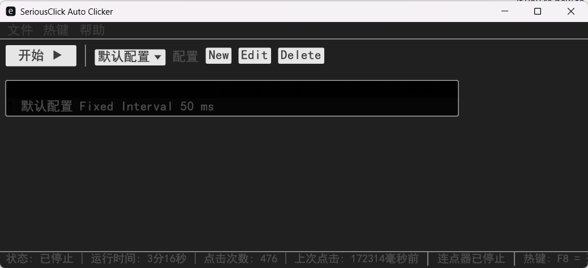

# SeriousClick - 专业连点器

一个用Rust编写的功能丰富、人性化的图形界面鼠标连点器应用程序。


## 功能特点

- **多种点击模式**：
  - 固定间隔点击：以固定的时间间隔进行点击
  - 随机间隔点击：在指定的最小和最大时间间隔范围内随机点击
  - 连续点击：以最快速度连续点击
  - 模式点击：按照自定义的时间间隔序列进行点击

- **多种鼠标按键支持**：
  - 左键
  - 右键
  - 中键

- **实时状态显示**：
  - 运行状态
  - 运行时间
  - 点击次数
  - 上次点击时间

- **配置管理**：
  - 创建、编辑和删除多个点击配置
  - 保存配置到文件，下次启动自动加载
  - 表格式显示所有配置

- **热键支持**：
  - F8 快捷键开始/停止连点
  - 可在界面中启用/禁用热键

- **友好的图形界面**：
  - 直观的表格显示配置
  - 简洁的编辑对话框
  - 状态栏实时显示运行信息

## 使用方法

### 基本操作

1. **启动/停止连点**：
   - 点击界面上的"开始"/"停止"按钮
   - 按F8热键（需先在热键菜单中启用）

2. **配置管理**：
   - 点击"新建"创建新配置
   - 点击"编辑"修改选中的配置
   - 点击"删除"移除选中的配置
   - 从下拉菜单选择要使用的配置

3. **保存配置**：
   - 在"文件"菜单中选择"保存配置"

4. **退出程序**：
   - 在"文件"菜单中选择"退出"
   - 点击窗口关闭按钮

### 配置选项

- **配置名称**：为配置指定一个易于识别的名称
- **点击模式**：选择固定间隔、随机间隔、连续点击或模式点击
- **鼠标按键**：选择左键、右键或中键
- **点击间隔**：根据选择的模式设置相应的间隔参数

## 技术实现

- 使用`egui`和`eframe`库实现图形界面
- 使用`enigo`库模拟鼠标点击
- 使用`rand`库生成随机间隔时间
- 使用`hotkey`库实现全局热键支持
- 使用`serde`和`serde_json`实现配置的序列化和反序列化
- 使用`directories`库获取配置文件路径
- 多线程实现点击功能，保持界面响应

## 编译与运行

```bash
# 克隆仓库
git clone https://github.com/yourusername/SeriousClick.git
cd SeriousClick

# 编译
cargo build --release

# 运行
cargo run --release
```

## 打包成应用程序

### Windows

```bash
# 安装cargo-wix（用于创建Windows安装程序）
cargo install cargo-wix

# 生成.msi安装包
cargo wix
```

生成的安装包将位于`target/wix/`目录下。

### 创建便携版

```bash
# 编译发布版本
cargo build --release

# 创建发布目录
mkdir -p release/SeriousClick

# 复制可执行文件和必要的资源
copy target/release/SeriousClick.exe release/SeriousClick/
```

## 注意事项

- 连点器运行时，鼠标指针位置即为点击位置
- 在某些应用程序或游戏中，可能需要以管理员权限运行才能正常工作
- 热键功能在某些系统上可能需要管理员权限才能正常工作
- 首次运行时会在用户配置目录创建配置文件

## 许可证

MIT License
- 请合理使用连点器，避免对系统或应用造成负担

## 许可证

MIT License